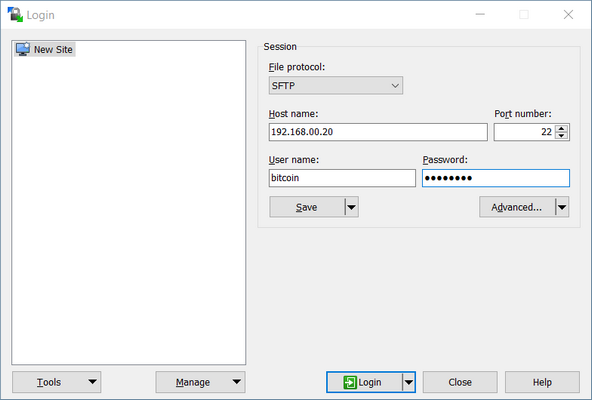
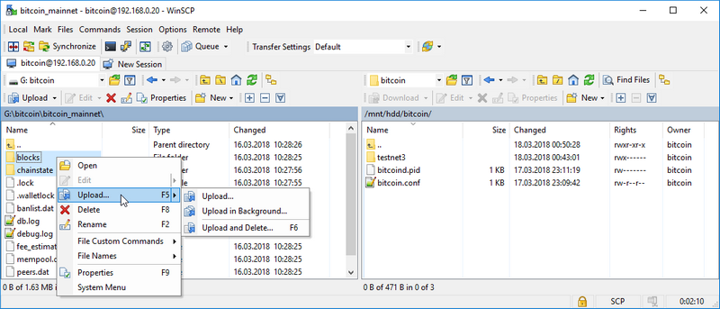

[ [Intro](README.md) ] -- [ [Preparations](raspibolt_10_preparations.md) ] -- [ [Raspberry Pi](raspibolt_20_pi.md) ] -- [ [Bitcoin](raspibolt_30_bitcoin.md) ] -- [ [Lightning](raspibolt_40_lnd.md) ] -- [ **Mainnet** ] -- [ [FAQ](raspibolt_faq.md) ]

-------
### Beginner’s Guide to ️⚡Lightning️⚡ on a Raspberry Pi
--------

# Mainnet
Are you feeling comfortable to put real bitcoin on the line? Here's how to do it. 
```
Disclaimer: This guide is provided as is and without any guarantees. Most components are under
development and this guide may contain factual errors that result in the loss of your bitcoin.
Use this guide at your own risk.
```
## Copy the mainnet blockchain
The current setup runs on Bitcoin testnet. Right at the beginning, however, we started downloading the Bitcoin mainnet blockchain on your regular computer. Check the verification progress directly in Bitcoin Core on this computer. To proceed, it  should be fully synced (see status bar). 

As soon as the verification is finished, shut down Bitcoin Core on Windows. We will now copy the whole data structure to the RaspiBolt. This takes about 6 hours.

### Temporarily enable password login
In order to copy the data with the user "bitcoin", we need to temporarily enable the password login.

* As user "admin", edit the SSH config file and put a `#` in front of "PasswordAuthentication no" to disable the whole line. Save and exit.  
  `$ sudo nano /etc/ssh/sshd_config`  
  `# PasswordAuthentication no` 

* Restart the SSH daemon.  
  `$ sudo systemctl restart ssh`
  
### Copy using WinSCP
We are using "Secure Copy" (SCP), so [download and install WinSCP](https://winscp.net), a free open-source program. 

* With WinSCP, you can now connect to your Pi with the user "bitcoin".  


* Accept the server certificate and navigate to the local and remote bitcoin directories:  
  * Local: `d:\bitcoin\bitcoin_mainnet\`
  * Remote: `\mnt\hdd\bitcoin\`   

* You can now copy the two subdirectories `blocks` and `chainstate` from Local to Remote. This will take about 6 hours.  


:warning: The transfer must not be interupted. Make sure your computer does not go to sleep. 

### Disable password login again
* As user "admin", remove the `#` in front of "PasswordAuthentication no" to enable the line. Save and exit.  
  `$ sudo nano /etc/ssh/sshd_config`  
  `PasswordAuthentication no` 

* Restart the SSH daemon.  
  `$ sudo systemctl restart ssh`

## Restart bitcoind & lnd for mainnet
Do not proceed until the copy task above is finished.

* As user "admin", stop the Bitcoin and Lightning services.  
  `$ sudo systemctl stop lnd`   
  `$ sudo systemctl stop bitcoind` 
  
* Edit "bitcoin.conf" file by commenting  `testnet=1` out. Save and exit.  
  `$ sudo nano /home/bitcoin/.bitcoin/bitcoin.conf`
```
# remove the following line to enable Bitcoin mainnet
#testnet=1
```
  
* Edit "lnd.conf" file by switching from `bitcoin.testnet=1` to `bitcoin.mainnet=1`. Save and exit.  
  `$ sudo nano /home/bitcoin/.bitcoin/bitcoin.conf`
```
# enable either testnet or mainnet
#bitcoin.testnet=1
bitcoin.mainnet=1
```
* Start Bitcoind and check if it's operating on mainnet  
  `$ sudo systemctl start bitcoind`  
  `$ systemctl status bitcoind.service`  
  `$ tail -f /home/bitcoin/.bitcoin/debug.log`  (exit with `Ctrl-C`)  
  `$ sudo su bitcoin`  
  `$ bitcoin-cli getblockchaininfo`  
  `$ exit`  

* Start LND and check its operation  
  `$ sudo systemctl start lnd`   
  `$ systemctl status lnd`  
  `$ sudo journalctl -f -u lnd`  

* If everything works fine, restart the RaspiBolt and check the operations again.
  `$ sudo shutdown -r now`  

## Start using the Lightning Network

coming soon.


--- 
Next: [FAQ >>](raspibolt_faq.md)
    


