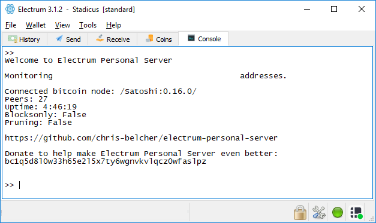

[ [Intro](README.md) ] -- [ [Preparations](raspibolt_10_preparations.md) ] -- [ [Raspberry Pi](raspibolt_20_pi.md) ] -- [ [Bitcoin](raspibolt_30_bitcoin.md) ] -- [ [Lightning](raspibolt_40_lnd.md) ] -- [ [Mainnet](raspibolt_50_mainnet.md) ] -- [ **Bonus** ] -- [ [FAQ](raspibolt_faq.md) ] -- [ [Updates](raspibolt_updates.md) ]

------

### Beginner’s Guide to ️⚡Lightning️⚡ on a Raspberry Pi

------

# Bonus (optional)

In this section, you can find various optional topics that make your RaspiBolt running even smoother. I split this up in various subsections, as the individual tasks can be quite long.

## [**System overview**](raspibolt_61_system-overview.md)

*Difficulty: easy*

Your RaspiBolt will greet you with a quick system summary on login:

  

## [**Pimp the command line**](raspibolt_62_commandline.md)

*Difficulty: easy*

Make your command line prompt shine with a golden ฿ and use more colors overall:

  

## [**Use `lncli` on a different computer**](raspibolt_66_remote_lncli.md)

*Difficulty: easy*

Control your Lightning node from a different computer within you network, eg. from a Windows machine.

  

## [**Electrum Personal Server**](raspibolt_64_electrum.md)

*Difficulty: intermediate*

The RaspiBolt is the perfect trustless Bitcoin backend for your regular on-chain transactions. Together with the Electrum wallet, it works even with your Ledger or Trezor hardware wallet.

   

## [**System recovery**](raspibolt_65_system-recovery.md)

Difficulty: easy

In case your SD card gets corrupted or you brick your node, it's handy to have a quick recovery image at hand. It's not a full backup solution, but allows a system recovery.

------

Next: [FAQ >>](raspibolt_faq.md)

