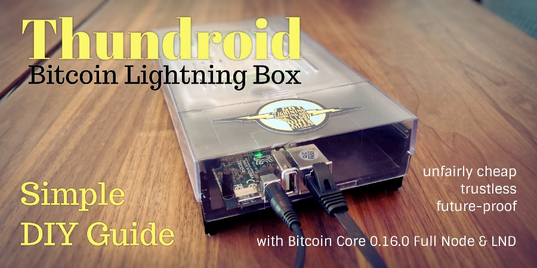
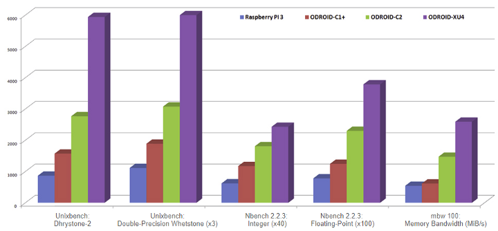

# The perfect Bitcoin ⚡️Lightning️⚡ node

My goal is to create the perfect Bitcoin Lightning node, running on unfairly cheap hardware, set up completely trustless from scratch. This guide brings you what I think is a near perfect solution.

Running our own nodes is important, both to learn more about this amazing technology, and also keep the network decentralized by not trusting any third party.

Being able to do that on cheap hardware is important. This is why I published the [Beginner’s Guide to Lightning on a Raspberry Pi](../raspibolt/README.md) (my RaspiBolt) which created a lot of positive feedback.

The Pi is available everywhere and has a huge community. It has some drawbacks, however, mainly in the area of performance and the the hassle with attaching external storage that is important when storing the whole Bitcoin blockchain. One feedback sparked my interest to consider the **Odroid HC2** mini-computer.

[**Hardkernel Odroid HC2**](http://www.hardkernel.com/main/products/prdt_info.php)  
*A mini PC that run Linux distributions like Ubuntu, Debian, Arch and OMW. Installed with a high performance SATA and Gigabit Ethernet port, with metal frame body designed to store a 2.5" HDD/SSD or 3.5" HDD with great heat dissipation.* 

Compared to a Rasperry Pi, it has the following advantages:

* price comparable to Raspberry Pi
* more powerful (8 core CPU, 2 GB RAM, Gigabit Ethernet)
* internal housing of harddisk, direct connection using SATA3
* only one power adapter for everything

Not available are features like HDMI output, built-in Wifi or GPIO pins, all of which are not relevant to this project, however.

Performance is way better, thus it seems more future-proof.

*Performance of Odroid HC2 is identical to XU4 (which is more of a media pc)*

I decided to try this setup, ordered the Odroid HC2 and, after setting it up and running it for a month now, I think this is as good as it gets for a low-cost Bitcoin / Lightning node. This is why I am going to describe the setup of a **Bitcoin Core** full node with a **LND** lightning node here, in case you might want to try this as well.

As this project needs a cheesy name as well, I’ll call my node **Thundroid**. :-)

### **Hardware Requirements**

I ordered the following items directly with Hardkernel in Singapore. There are [resellers](http://www.hardkernel.com/main/distributor.php) available worldwide, but not for Switzerland, unfortunately.

* [Hardkernel Odroid HC2](http://www.hardkernel.com/main/products/prdt_info.php?g_code=G151505170472) ($54)
* [Power adapter & cord](http://www.hardkernel.com/main/products/prdt_info.php?g_code=G151578376044) ($7)
* optional: [Odroid HC2 case](http://www.hardkernel.com/main/products/prdt_info.php?g_code=G151596669222) ($5)

You also need the following:

* Micro SD card: 8 GB or more, incl. adapter to your regular computer
* Internal hard disk: 500 GB or more, SATA, 3.5" hdd, or 2.5" hdd/ssd
* Network RJ45 cable

#### Considerations for Bitcoin mainnet

This guide is configured to use the Bitcoin testnet. You can easily download and verify the blockchain using the Odroid HC2. However, for a switch to Bitcoin mainnet, will will need to initially download and verify the Bitcoin blockchain on a regular computer (only once, not regularly).

There are multiple options (not covered in this guide) to transfer the mainnet blockchain (~200 GB) to your node:

* connect your internal hard disk directly to your computer,
* transfer the blockchain over the network
* use an additional external hard disk to transfer the data via USB.

We are going to format the internal hard disk using the Ext4 file system, which is not compatible with windows. If you want to connect the hard disk later to a windows computer, you need [additional software](http://www.paragon-drivers.com/extfs-windows/) (free for once-time-usage).

#### Assemble the hardware

Assembly is easy, just enter the hard disk and fix it with the the screws included with your Odroid. If you ordered the plastic case, just slide it over the metal body.

---

Now, apart from a few quirks, you can follow the [generic Ubuntu 16.04 guide](README.md).

---
